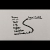
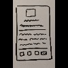
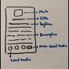

[](https://app.netlify.com/sites/ejelome-mui-card/deploys)

# mui-card

Learn [Material-UI](https://material-ui.com) with a card

---

<!-- markdown-toc start - Don't edit this section. Run M-x markdown-toc-refresh-toc -->

**Table of Contents**

- [mui-card](#mui-card)
  - [Demo](#demo)
  - [Setup](#setup)
    - [Install](#install)
  - [Usage](#usage)
    - [Serve](#serve)
    - [Test](#test)
    - [Build](#build)
  - [Prototypes](#prototypes)
    - [Mobile](#mobile)
  - [Lessons](#lessons)
    - [1. Setup](#1-setup)
      - [1.1. Install](#11-install)
      - [1.2. Configure](#12-configure)
        - [1.2.1. CssBaseline](#121-cssbaseline)
        - [1.2.2. Roboto font](#122-roboto-font)
        - [1.2.3. Viewport](#123-viewport)
    - [2. Theming](#2-theming)
      - [2.1. makeStyles](#21-makestyles)
      - [2.2. useTheme](#22-usetheme)
      - [2.3. hue[shade]](#23-hueshade)
      - [2.4. Custom theme](#24-custom-theme)
      - [2.5. responsiveFontSizes](#25-responsivefontsizes)
    - [3. Layout](#3-layout)
      - [3.1. Box](#31-box)
      - [3.2. Container](#32-container)
      - [3.3. Grid](#33-grid)
      - [3.4. Hidden](#34-hidden)
    - [4. Inputs](#4-inputs)
      - [4.1. Button](#41-button)
    - [5. Navigation](#5-navigation)
      - [5.1. Links](#51-links)
    - [6. Surfaces](#6-surfaces)
      - [6.1. Card](#61-card)
      - [6.2. Paper](#62-paper)
    - [7. Data Display](#7-data-display)
      - [7.1. Avatar](#71-avatar)
      - [7.2. Divider](#72-divider)
      - [7.3 Typography](#73-typography)
    - [8. Utils](#8-utils)
      - [8.1. CssBaseline](#81-cssbaseline)
  - [References](#references)
  - [License](#license)

<!-- markdown-toc end -->

---

## Demo

See <https://ejelome-mui-card.netlify.app>.

---

## Setup

### Install

```shell
$ npm [install|isntall|add|i]
```

---

## Usage

### Serve

```shell
$ npm start
```

### Test

```shell
$ npm [test|tst|t]
```

### Build

```shell
$ npm run build
```

---

## Prototypes

### Mobile

[](./.prototypes/images/breadboard.jpg "Breadboard")
[](./.prototypes/images/sketch.jpg "Sketch")
[](./.prototypes/images/elements.jpg "Elements")

---

## Lessons

### 1. Setup

#### 1.1. Install

```shell
$ npm i @material-ui/{core,icons} \
        fontsource-roboto
```

> **Notes:**
>
> - [`icons`](https://material-ui.com/components/material-icons) package are converted [`SvgIcon`](https://material-ui.com/api/svg-icon) components
> - `SvgIcon`s use [PascalCase](https://wiki.c2.com/?PascalCase) as naming convention
> - [Roboto](https://fonts.google.com/specimen/Roboto) fonts must be specified manually

#### 1.2. Configure

##### 1.2.1. CssBaseline

<details>
  <summary>src/App.js</summary>

```diff
-import React from 'react';
-import logo from './logo.svg';
-import './App.css';
+import { CssBaseline } from "@material-ui/core";
+import React from "react";

-function App() {
-  return (
-    <div className="App">
-      <header className="App-header">
-        
-        <p>
-          Edit <code>src/App.js</code> and save to reload.
-        </p>
-        <a
-          className="App-link"
-          href="https://reactjs.org"
-          target="_blank"
-          rel="noopener noreferrer"
-        >
-          Learn React
-        </a>
-      </header>
-    </div>
-  );
-}
+const App = () => (
+  <>
+    <CssBaseline />
+  </>
+);

 export default App;
```

</details>

[&#9654; Run code &rarr;](https://codesandbox.io/s/mui-card-lesson-121-wmigr)

> **Note:** <br />
> The [`<CssBaseline />`](https://material-ui.com/components/css-baseline) fix inconsistencies across browsers and devices with an opinionated resets.

##### 1.2.2. Roboto font

<details>
  <summary>src/App.js</summary>

```diff
-import { CssBaseline } from "@material-ui/core";
-import React from "react";
-
-const App = () => (
-  <>
-    <CssBaseline />
-  </>
-);
-
-export default App;
+import "fontsource-roboto/300.css";
+import "fontsource-roboto/400.css";
+import "fontsource-roboto/500.css";
+import "fontsource-roboto/700.css";

-import { CssBaseline } from "@material-ui/core";
+import { CssBaseline, Typography } from "@material-ui/core";
 import React from "react";

 const App = () => (
   <>
     <CssBaseline />
+    <Typography variant="h1">hello, world</Typography>
   </>
 );

 export default App;
```

</details>

[&#9654; Run code &rarr;](https://codesandbox.io/s/mui-card-lesson-122-k3enh)

> **Note:** <br />
> Only `300`, `400`, `500` and `700` of typography font weights are being used by Material-UI.

##### 1.2.3. Viewport

<details>
  <summary>public/index.html</summary>

```diff
 <!DOCTYPE html>
 <html lang="en">
   <head>
     <meta charset="utf-8" />
     <link rel="icon" href="%PUBLIC_URL%/favicon.ico" />
-    <meta name="viewport" content="width=device-width, initial-scale=1" />
+    <meta
+      name="viewport"
+      content="minimum-scale=1, initial-scale=1, width=device-width"
+    />
+
     <meta name="theme-color" content="#000000" />
     <meta
       name="description"
       content="Web site created using create-react-app"
     />
     <link rel="apple-touch-icon" href="%PUBLIC_URL%/logo192.png" />
     <!--
       manifest.json provides metadata used when your web app is installed on a
       user's mobile device or desktop. See https://developers.google.com/web/fundamentals/web-app-manifest/
     -->
     <link rel="manifest" href="%PUBLIC_URL%/manifest.json" />
     <!--
       Notice the use of %PUBLIC_URL% in the tags above.
       It will be replaced with the URL of the `public` folder during the build.
       Only files inside the `public` folder can be referenced from the HTML.

       Unlike "/favicon.ico" or "favicon.ico", "%PUBLIC_URL%/favicon.ico" will
       work correctly both with client-side routing and a non-root public URL.
       Learn how to configure a non-root public URL by running `npm run build`.
     -->
     <title>React App</title>
   </head>
   <body>
     <noscript>You need to enable JavaScript to run this app.</noscript>
     <div id="root"></div>
     <!--
       This HTML file is a template.
       If you open it directly in the browser, you will see an empty page.

       You can add webfonts, meta tags, or analytics to this file.
       The build step will place the bundled scripts into the <body> tag.

       To begin the development, run `npm start` or `yarn start`.
       To create a production bundle, use `npm run build` or `yarn build`.
     -->
   </body>
 </html>
```

</details>

[&#9654; Run code &rarr;](https://codesandbox.io/s/mui-card-lesson-123-p86mq?file=/public/index.html)

> **Note:** <br />
> The [`<meta name="viewport" />`](https://developer.mozilla.org/en-US/docs/Mozilla/Mobile/Viewport_meta_tag#Enter_viewport_meta_tag) ensures proper rendering and touch zooming for all browsers and devices.

### 2. Theming

#### 2.1. makeStyles

<details>
  <summary>src/App.js</summary>

```diff
 import "fontsource-roboto/300.css";
 import "fontsource-roboto/400.css";
 import "fontsource-roboto/500.css";
 import "fontsource-roboto/700.css";

 import { CssBaseline, Typography } from "@material-ui/core";
+import { makeStyles } from "@material-ui/core/styles";
 import React from "react";

-const App = () => (
-  <>
-    <CssBaseline />
-    <Typography variant="h1">hello, world</Typography>
-  </>
-);
+const useStyles = makeStyles(({ palette }) => ({
+  root: {
+    backgroundColor: palette.common.black,
+    "& h1": { color: palette.common.white },
+  },
+}));
+
+const App = () => {
+  const { root } = useStyles();
+
+  return (
+    <div className={root}>
+      <CssBaseline />
+      <Typography variant="h1">hello, world</Typography>
+    </div>
+  );
+};

 export default App;
```

</details>

[&#9654; Run code &rarr;](https://codesandbox.io/s/mui-card-lesson-21-w06uw)

> **Notes:**
>
> - [`makeStyles`](https://material-ui.com/styles/api/#makestyles-styles-options-hook) links a style sheet with a function component (returns a hook)
> - `makeStyles(props)` can mix values of component `props` with `theme` object
> - `theme` property object contains the design properties of the application
> - `"&"` implies child elements under the element where `root` was assigned

#### 2.2. useTheme

<details>
  <summary>src/App.js</summary>

```diff
 import "fontsource-roboto/300.css";
 import "fontsource-roboto/400.css";
 import "fontsource-roboto/500.css";
 import "fontsource-roboto/700.css";

 import { CssBaseline, Typography } from "@material-ui/core";
-import { makeStyles } from "@material-ui/core/styles";
+import { makeStyles, useTheme } from "@material-ui/core/styles";
 import React from "react";

 const useStyles = makeStyles(({ palette }) => ({
   root: {
     backgroundColor: palette.common.black,
     "& h1": { color: palette.common.white },
   },
 }));

 const App = () => {
   const { root } = useStyles();
+  const { palette } = useTheme();

   return (
     <div className={root}>
       <CssBaseline />
-      <Typography variant="h1">hello, world</Typography>
+      <Typography variant="h1">hello, {palette.type} world</Typography>
     </div>
   );
 };

 export default App;
```

</details>

[&#9654; Run code &rarr;](https://codesandbox.io/s/mui-card-lesson-22-beg2g)

> **Note:** <br />
> The [`useTheme`](https://material-ui.com/styles/api/#usetheme-theme) hook returns the `theme` object that has access to theme's properties.

#### 2.3. hue[shade]

<details>
  <summary>src/App.js</summary>

```diff
 import "fontsource-roboto/300.css";
 import "fontsource-roboto/400.css";
 import "fontsource-roboto/500.css";
 import "fontsource-roboto/700.css";

 import { CssBaseline, Typography } from "@material-ui/core";
+import { grey } from "@material-ui/core/colors";
 import { makeStyles, useTheme } from "@material-ui/core/styles";
 import React from "react";

 const useStyles = makeStyles(({ palette }) => ({
   root: {
-    backgroundColor: palette.common.black,
-    "& h1": { color: palette.common.white },
+    backgroundColor: grey[900], // near-black: #212121
+    "& h1": { color: grey[50] }, // near-white: #fafafa
   },
 }));

 const App = () => {
   const { root } = useStyles();
   const { palette } = useTheme();

   return (
     <div className={root}>
       <CssBaseline />
       <Typography variant="h1">hello, {palette.type} world</Typography>
     </div>
   );
 };

 export default App;
```

</details>

[&#9654; Run code &rarr;](https://codesandbox.io/s/mui-card-lesson-23-uyq61)

> **Note:** <br />
> The `grey` object is one of MUI's [color palette](https://material-ui.com/customization/color/#color-palette)s (`grey[50…900]` means `hue[shade]`).

#### 2.4. Custom theme

<details>
  <summary>src/App.js</summary>

```diff
 import "fontsource-roboto/300.css";
 import "fontsource-roboto/400.css";
 import "fontsource-roboto/500.css";
 import "fontsource-roboto/700.css";

 import { CssBaseline, Typography } from "@material-ui/core";
 import { grey } from "@material-ui/core/colors";
-import { makeStyles, useTheme } from "@material-ui/core/styles";
+import {
+  createMuiTheme,
+  makeStyles,
+  ThemeProvider,
+  useTheme,
+} from "@material-ui/core/styles";
 import React from "react";

+const theme = createMuiTheme({ palette: { type: "dark" } });
 const useStyles = makeStyles(({ palette }) => ({
   root: {
     backgroundColor: grey[900], // near-black: #212121
     "& h1": { color: grey[50] }, // near-white: #fafafa
   },
 }));

 const App = () => {
   const { root } = useStyles();
   const { palette } = useTheme();

   return (
-    <div className={root}>
-      <CssBaseline />
-      <Typography variant="h1">hello, {palette.type} world</Typography>
-    </div>
+    <ThemeProvider theme={theme}>
+      <div className={root}>
+        <CssBaseline />
+        <Typography variant="h1">hello, {palette.type} world</Typography>
+      </div>
+    </ThemeProvider>
   );
 };

 export default App;
```

</details>

[&#9654; Run code &rarr;](https://codesandbox.io/s/mui-card-lesson-24-c9i4t)

> **Notes:**
>
> - [`createMuiTheme`](https://material-ui.com/customization/theming/#createmuitheme-options-args-theme) returns the [default theme](https://material-ui.com/customization/default-theme) object that can be overridden
> - [`<ThemeProvider>`](https://material-ui.com/styles/api/#themeprovider) can pass `theme` as property to allow its children to access theme properties

#### 2.5. responsiveFontSizes

<details>
  <summary>src/App.js</summary>

```diff
 import "fontsource-roboto/300.css";
 import "fontsource-roboto/400.css";
 import "fontsource-roboto/500.css";
 import "fontsource-roboto/700.css";

 import { CssBaseline, Typography } from "@material-ui/core";
 import { grey } from "@material-ui/core/colors";
 import {
   createMuiTheme,
   makeStyles,
+  responsiveFontSizes,
   ThemeProvider,
   useTheme,
 } from "@material-ui/core/styles";
 import React from "react";

-const theme = createMuiTheme({ palette: { type: "dark" } });
+let theme = createMuiTheme({ palette: { type: "dark" } });
+theme = responsiveFontSizes(theme);
 const useStyles = makeStyles(({ palette }) => ({
   root: {
     backgroundColor: grey[900], // near-black: #212121
     "& h1": { color: grey[50] }, // near-white: #fafafa
   },
 }));

 const App = () => {
   const { root } = useStyles();
   const { palette } = useTheme();

   return (
     <ThemeProvider theme={theme}>
       <div className={root}>
         <CssBaseline />
         <Typography variant="h1">hello, {palette.type} world</Typography>
       </div>
     </ThemeProvider>
   );
 };

 export default App;
```

</details>

[&#9654; Run code &rarr;](https://codesandbox.io/s/mui-card-lesson-25-zywx5)

> **Note:** <br />
> The [`responsiveFontSizes`](https://material-ui.com/customization/theming/#responsivefontsizes-theme-options-theme) generates responsive typography for the theme.

### 3. Layout

#### 3.1. Box

<details>
  <summary>src/App.js</summary>

```diff
 import "fontsource-roboto/300.css";
 import "fontsource-roboto/400.css";
 import "fontsource-roboto/500.css";
 import "fontsource-roboto/700.css";

-import { CssBaseline, Typography } from "@material-ui/core";
+import { Box, CssBaseline, Typography } from "@material-ui/core";
 import { grey } from "@material-ui/core/colors";
 import {
+  createMuiTheme,
   makeStyles,
+  responsiveFontSizes,
   ThemeProvider,
   useTheme,
-  createMuiTheme,
-  responsiveFontSizes,
 } from "@material-ui/core/styles";
 import React from "react";

 let theme = createMuiTheme({ palette: { type: "dark" } });
 theme = responsiveFontSizes(theme);
 const useStyles = makeStyles(({ palette }) => ({
   root: {
     backgroundColor: grey[900], // near-black: #212121
     "& h1": { color: grey[50] }, // near-white: #fafafa
   },
 }));

 const App = () => {
   const { root } = useStyles();
   const { palette } = useTheme();

   return (
     <ThemeProvider theme={theme}>
       <div className={root}>
         <CssBaseline />
-        <Typography variant="h1">hello, {palette.type} world</Typography>
+        <Typography variant="h1">
+          hello,{" "}
+          <Box component="span" bgcolor="text.secondary" color="text.primary">
+            {palette.type}
+          </Box>{" "}
+          world
+        </Typography>
       </div>
     </ThemeProvider>
   );
 };

 export default App;
```

</details>

[&#9654; Run code &rarr;](https://codesandbox.io/s/mui-card-lesson-31-24hkm)

> **Notes:**
>
> - [`<Box>`](https://material-ui.com/components/box) can access the full list of [style functions](https://material-ui.com/system/basics/#all-inclusive)
> - Use the `component` property to replace the element wrapper

#### 3.2. Container

<details>
  <summary>src/App.js</summary>

```diff
 import "fontsource-roboto/300.css";
 import "fontsource-roboto/400.css";
 import "fontsource-roboto/500.css";
 import "fontsource-roboto/700.css";

-import { Box, CssBaseline, Typography } from "@material-ui/core";
+import { Box, Container, CssBaseline, Typography } from "@material-ui/core";
 import { grey } from "@material-ui/core/colors";
 import {
   createMuiTheme,
   makeStyles,
   responsiveFontSizes,
   ThemeProvider,
   useTheme,
 } from "@material-ui/core/styles";
 import React from "react";

 let theme = createMuiTheme({ palette: { type: "dark" } });
 theme = responsiveFontSizes(theme);
 const useStyles = makeStyles(({ palette }) => ({
   root: {
     backgroundColor: grey[900], // near-black: #212121
     "& h1": { color: grey[50] }, // near-white: #fafafa
   },
 }));

 const App = () => {
   const { root } = useStyles();
   const { palette } = useTheme();

   return (
     <ThemeProvider theme={theme}>
-      <div className={root}>
+      <Container className={root} disableGutters={true}>
         <CssBaseline />
         <Typography variant="h1">
           hello,{" "}
           <Box component="span" bgcolor="text.secondary" color="text.primary">
             {palette.type}
           </Box>{" "}
           world
         </Typography>
-      </div>
+      </Container>
     </ThemeProvider>
   );
 };

 export default App;
```

</details>

[&#9654; Run code &rarr;](https://codesandbox.io/s/mui-card-lesson-32-5ppkq)

> **Notes:**
>
> - [`<Container>`](https://material-ui.com/components/container) centers its children horizontally
> - By default, `maxWidth` uses `lg` as grid breakpoint
> - `disableGutters` removes left and right `padding`

#### 3.3. Grid

<details>
  <summary>src/App.js</summary>

```diff
 import "fontsource-roboto/300.css";
 import "fontsource-roboto/400.css";
 import "fontsource-roboto/500.css";
 import "fontsource-roboto/700.css";

-import { Box, Container, CssBaseline, Typography } from "@material-ui/core";
+import {
+  Box,
+  Container,
+  CssBaseline,
+  Grid,
+  Paper,
+  Typography,
+} from "@material-ui/core";
 import { grey } from "@material-ui/core/colors";
 import {
   createMuiTheme,
   makeStyles,
   responsiveFontSizes,
   ThemeProvider,
   useTheme,
 } from "@material-ui/core/styles";
+import { Mood } from "@material-ui/icons";
 import React from "react";

 let theme = createMuiTheme({ palette: { type: "dark" } });
 theme = responsiveFontSizes(theme);
 const useStyles = makeStyles(({ palette }) => ({
   root: {
     backgroundColor: grey[900], // near-black: #212121
     "& h1": { color: grey[50] }, // near-white: #fafafa
   },
 }));

 const App = () => {
   const { root } = useStyles();
   const { palette } = useTheme();

   return (
     <ThemeProvider theme={theme}>
       <Container className={root} disableGutters={true}>
         <CssBaseline />
-        <Typography variant="h1">
-          hello,{" "}
-          <Box component="span" bgcolor="text.secondary" color="text.primary">
-            {palette.type}
-          </Box>{" "}
-          world
-        </Typography>
+        <Grid
+          component={Paper}
+          elevation={0}
+          container
+          direction="column"
+          alignItems="center"
+          spacing={4}
+        >
+          <Grid item>
+            <Box mt={4}>
+              
+            </Box>
+          </Grid>
+          <Grid item>
+            <Typography variant="h1">hello, {palette.type} world</Typography>
+          </Grid>
+          <Grid item>
+            <Typography variant="subtitle1">subtitle</Typography>
+          </Grid>
+          <Grid item>
+            <Typography variant="body1">description</Typography>
+          </Grid>
+          <Grid item container justify="space-evenly">
+            <Mood />
+          </Grid>
+        </Grid>
       </Container>
     </ThemeProvider>
   );
 };

 export default App;
```

</details>

[&#9654; Run code &rarr;](https://codesandbox.io/s/mui-card-lesson-33-kmxjz)

> **Notes:**
>
> - [`<Grid>`](https://material-ui.com/components/grid) is based on [Material Design](https://material.io/design/layout/responsive-layout-grid.html)'s 12-column [responsive layout grid](https://material.io/design/layout/responsive-layout-grid.html)
> - It implements the grid system using [CSS Flexible Box Layout Module](https://www.w3.org/TR/css-flexbox-1)
> - Types of grid layout includes: `container` or `item`
> - Supports nested grids by using both `container` and `item`
> - Supports five available grid [breakpoints](https://material-ui.com/customization/breakpoints/#default-breakpoints): `xs`, `sm`, `md`, `lg` and `xl`
> - Each grid uses percentage (fluid) and relative to parent element
> - Each grid has `padding` used to space content within the each grid item
> - Each grid are separated with [`spacing`](https://material-ui.com/customization/spacing) theme property
> - Each `spacing` is `8px` (minimum: `0`, maximum: `10`)
> - Each grid automatically resizes on available space (auto-layout)
> - [`<Paper>`](https://material-ui.com/components/paper) can be used as `<Grid>`'s `component` wrapper
> - `<Paper>`'s `props` becomes part of `<Grid>`'s `props`

#### 3.4. Hidden

<details>
  <summary>src/App.js</summary>

```diff
 import "fontsource-roboto/300.css";
 import "fontsource-roboto/400.css";
 import "fontsource-roboto/500.css";
 import "fontsource-roboto/700.css";

 import {
   Box,
   Container,
   CssBaseline,
   Grid,
+  Hidden,
   Paper,
   Typography,
 } from "@material-ui/core";
 import { grey } from "@material-ui/core/colors";
 import {
   createMuiTheme,
   makeStyles,
   responsiveFontSizes,
   ThemeProvider,
   useTheme,
 } from "@material-ui/core/styles";
-import { Mood } from "@material-ui/icons";
+import { Mood, MoreHoriz } from "@material-ui/icons";
 import React from "react";

 let theme = createMuiTheme({ palette: { type: "dark" } });
 theme = responsiveFontSizes(theme);
 const useStyles = makeStyles(({ palette }) => ({
   root: {
     backgroundColor: grey[900], // near-black: #212121
     "& h1": { color: grey[50] }, // near-white: #fafafa
   },
 }));

 const App = () => {
   const { root } = useStyles();
   const { palette } = useTheme();

   return (
     <ThemeProvider theme={theme}>
       <Container className={root} disableGutters={true}>
         <CssBaseline />
         <Grid
           component={Paper}
           elevation={0}
           container
           direction="column"
           alignItems="center"
           spacing={4}
         >
           <Grid item>
             <Box mt={4}>
               
             </Box>
           </Grid>
           <Grid item>
             <Typography variant="h1">hello, {palette.type} title</Typography>
           </Grid>
           <Grid item>
             <Typography variant="subtitle1">subtitle</Typography>
           </Grid>
           <Grid item>
             <Typography variant="body1">description</Typography>
           </Grid>
           <Grid item container justify="space-evenly">
             <Mood />
+            <Hidden smUp>
+              <MoreHoriz />
+            </Hidden>
           </Grid>
         </Grid>
       </Container>
     </ThemeProvider>
   );
 };

 export default App;
```

</details>

[&#9654; Run code &rarr;](https://codesandbox.io/s/mui-card-lesson-34-5n9mg)

> **Notes:**
>
> - [`<Hidden>`](https://material-ui.com/components/hidden) toggles component visibility with breakpoints
> - It is used in conjuction with `<Grid>`
> - By default, `js` is used to responsively hide components
> - `up` or `down` `props` hides _at_ or _above_ or _below_ breakpoint
> - `only` hides _at exact_ (`String` or `Array`) of breakpoint(s)

### 4. Inputs

#### 4.1. Button

<details>
  <summary>src/App.js</summary>

```diff
 import "fontsource-roboto/300.css";
 import "fontsource-roboto/400.css";
 import "fontsource-roboto/500.css";
 import "fontsource-roboto/700.css";

 import {
   Box,
   Container,
   CssBaseline,
   Grid,
   Hidden,
+  IconButton,
   Paper,
   Typography,
 } from "@material-ui/core";
 import { grey } from "@material-ui/core/colors";
 import {
   createMuiTheme,
   makeStyles,
   responsiveFontSizes,
   ThemeProvider,
   useTheme,
 } from "@material-ui/core/styles";
-import { Mood, MoreHoriz } from "@material-ui/icons";
+import { Facebook, MoreHoriz } from "@material-ui/icons";
 import React from "react";

 let theme = createMuiTheme({ palette: { type: "dark" } });
 theme = responsiveFontSizes(theme);
 const useStyles = makeStyles(({ palette }) => ({
   root: {
     backgroundColor: grey[900], // near-black: #212121
     "& h1": { color: grey[50] }, // near-white: #fafafa
   },
 }));

 const App = () => {
   const { root } = useStyles();
   const { palette } = useTheme();

   return (
     <ThemeProvider theme={theme}>
       <Container className={root} disableGutters={true}>
         <CssBaseline />
         <Grid
           component={Paper}
           elevation={0}
           container
           direction="column"
           alignItems="center"
           spacing={4}
         >
           <Grid item>
             <Box mt={4}>
               
             </Box>
           </Grid>
           <Grid item>
             <Typography variant="h1">hello, {palette.type} title</Typography>
           </Grid>
           <Grid item>
             <Typography variant="subtitle1">subtitle</Typography>
           </Grid>
           <Grid item>
             <Typography variant="body1">description</Typography>
           </Grid>
           <Grid item container justify="space-evenly">
-            <Mood />
+            <IconButton href="https://facebook.com">
+              <Facebook />
+            </IconButton>
             <Hidden smUp>
               <MoreHoriz />
             </Hidden>
           </Grid>
         </Grid>
       </Container>
     </ThemeProvider>
   );
 };

 export default App;
```

</details>

[&#9654; Run code &rarr;](https://codesandbox.io/s/mui-card-lesson-41-yw8rb)

> **Notes:**
>
> - [`<Button>`](https://material-ui.com/components/buttons) communicates user actions
> - `<Button>`s typically is used in conjunction with `onClick` event
> - Use `contained` as `variant` `props` for primary and highly important actions
> - Use `outlined` as `variant` `props` for non-primary but important actions
> - Use a regular button (without `variant` `props`) for non-critical actions
> - Use `startIcon` `props` to prepend `<Button>` with an [icon](https://material-ui.com/ecomponents/icons) component
> - Use `<IconButton>` component to simply render a clickable icon
> - Use `<LoadingButton>` component to show pending state and disable interaction
> - For internal links, use `<Link>` from [`react-router-dom`](https://github.com/ReactTraining/react-router) with `component` and `to` `props`
> - `react-router-dom`'s `<Link>` must be within [`react-router`](https://reactrouter.com)'s '`<MemoryRouter>`
> - For external links, use `href` `props` (e.g. `<Button href={url}>…`); `url`'s [protocol](https://developer.mozilla.org/en-US/docs/Glossary/Protocol) is required

### 5. Navigation

#### 5.1. Links

<details>
  <summary>src/App.js</summary>

```diff
 import "fontsource-roboto/300.css";
 import "fontsource-roboto/400.css";
 import "fontsource-roboto/500.css";
 import "fontsource-roboto/700.css";

 import {
   Box,
   Container,
   CssBaseline,
   Grid,
   Hidden,
   IconButton,
+  Link,
   Paper,
   Typography,
 } from "@material-ui/core";
 import { grey } from "@material-ui/core/colors";
 import {
   createMuiTheme,
   makeStyles,
   responsiveFontSizes,
   ThemeProvider,
   useTheme,
 } from "@material-ui/core/styles";
 import { Facebook, MoreHoriz } from "@material-ui/icons";
 import React from "react";

 let theme = createMuiTheme({ palette: { type: "dark" } });
 theme = responsiveFontSizes(theme);
 const useStyles = makeStyles(({ palette }) => ({
   root: {
     backgroundColor: grey[900], // near-black: #212121
     "& h1": { color: grey[50] }, // near-white: #fafafa
   },
 }));

 const App = () => {
   const { root } = useStyles();
   const { palette } = useTheme();

   return (
     <ThemeProvider theme={theme}>
       <Container className={root} disableGutters={true}>
         <CssBaseline />
         <Grid
           component={Paper}
           elevation={0}
           container
           direction="column"
           alignItems="center"
           spacing={4}
         >
           <Grid item>
             <Box mt={4}>
               
             </Box>
           </Grid>
           <Grid item>
-            <Typography variant="h1">hello, {palette.type} title</Typography>
+            <Link href="#" variant="h1" color="inherit">
+              hello, {palette.type} title
+            </Link>
           </Grid>
           <Grid item>
             <Typography variant="subtitle1">subtitle</Typography>
           </Grid>
           <Grid item>
             <Typography variant="body1">description</Typography>
           </Grid>
           <Grid item container justify="space-evenly">
             <IconButton href="https://facebook.com">
               <Facebook />
             </IconButton>
             <Hidden smUp>
               <MoreHoriz />
             </Hidden>
           </Grid>
         </Grid>
       </Container>
     </ThemeProvider>
   );
 };

 export default App;
```

</details>

[&#9654; Run code &rarr;](https://codesandbox.io/s/mui-card-lesson-51-81cho)

> **Notes:**
>
> - [`<Link>`](https://material-ui.com/components/links) customize anchor elements with theme colors and typography styles
> - `<Link>` is built on top of `<Typography>` and shares all of its `props`
> - Use `rel="noopener"` to prevent external redirects
> - Use `rel="noreferrer"` to prevent sending _Referer_ header
> - Implementing internal links is similar to `<Button>`

### 6. Surfaces

#### 6.1. Card

<details>
  <summary>src/App.js</summary>

```diff
 import "fontsource-roboto/300.css";
 import "fontsource-roboto/400.css";
 import "fontsource-roboto/500.css";
 import "fontsource-roboto/700.css";

 import {
-  Box,
+  Card,
+  CardActions,
+  CardContent,
+  CardHeader,
   Container,
   CssBaseline,
-  Grid,
   Hidden,
   IconButton,
   Link,
   Paper,
   Typography,
 } from "@material-ui/core";
 import { grey } from "@material-ui/core/colors";
 import {
   createMuiTheme,
   makeStyles,
   responsiveFontSizes,
   ThemeProvider,
   useTheme,
 } from "@material-ui/core/styles";
 import { Facebook, MoreHoriz } from "@material-ui/icons";
 import React from "react";

 let theme = createMuiTheme({ palette: { type: "dark" } });
 theme = responsiveFontSizes(theme);
 const useStyles = makeStyles(({ palette }) => ({
   root: {
-    backgroundColor: grey[900], // near-black: #212121
-    "& h1": { color: grey[50] }, // near-white: #fafafa
+    backgroundColor: grey[900],
+    textAlign: "center", // near-black: #212121
+    "& h1": { color: grey[50] }, // near-white: #fafafa,
+    "& .MuiCardHeader-root": { display: "inline" },
+    "& .MuiCardHeader-avatar": { marginTop: theme.spacing(4) },
+    "& .MuiCardActions-root": { display: "flex", justifyContent: "center" },
   },
 }));

 const App = () => {
   const { root } = useStyles();
   const { palette } = useTheme();

   return (
     <ThemeProvider theme={theme}>
       <Container className={root} disableGutters={true}>
         <CssBaseline />
-        <Grid
-          component={Paper}
-          elevation={0}
-          container
-          direction="column"
-          alignItems="center"
-          spacing={4}
-        >
-          <Grid item>
-            <Box mt={4}>
+        <Card component={Paper}>
+          <CardHeader
+            avatar={
               
-            </Box>
-          </Grid>
-          <Grid item>
-            <Link href="#" variant="h1" color="inherit">
+            }
+          />
+          <CardContent>
+            <Link variant="h1" color="inherit">
               hello, {palette.type} title
             </Link>
-          </Grid>
-          <Grid item>
             <Typography variant="subtitle1">subtitle</Typography>
-          </Grid>
-          <Grid item>
             <Typography variant="body1">description</Typography>
-          </Grid>
-          <Grid item container justify="space-evenly">
-            <IconButton href="https://facebook.com">
-              <Facebook />
-            </IconButton>
-            <Hidden smUp>
-              <MoreHoriz />
-            </Hidden>
-          </Grid>
-        </Grid>
+          </CardContent>
+        </Card>
+        <CardActions>
+          <IconButton href="https://facebook.com">
+            <Facebook />
+          </IconButton>
+          <Hidden smUp>
+            <MoreHoriz />
+          </Hidden>
+        </CardActions>
       </Container>
     </ThemeProvider>
   );
 };

 export default App;
```

</details>

[&#9654; Run code &rarr;](https://codesandbox.io/s/mui-card-lesson-61-vxi1e)

> **Notes:**
>
> - [`<Card>`](https://material-ui.com/components/cards) wraps content and actions for a single topic
> - `<CardMedia>` acts as banner and `<CardHeader>` as header
> - `<CardContent>` acts as body and `<CardActions>` as footer
> - `<CardActions>` contain UI controls and is placed at the bottom
> - `<Card>` inherits from `<Paper>` and so its `props` are availabe
> - Use _only_ as entry point to a more complex and detailed information
> - Use `outline` as value for `variant` `props` to render an outlined card

#### 6.2. Paper

<details>
  <summary>&lt;Paper&gt;</summary>

```javascript
<Paper>…</Paper>                      // wraps child components
<Wrapper component={Paper}></Wrapper> // use <Paper> as wrapper
```

</details>

> **Notes:**
>
> - [`<Paper>`](https://material-ui.com/components/paper) tries to emulate properties of a real paper to the screen
> - It can be used to explicitly wrap child elements
> - Or be assigned as wrapper with `component` `props`
> - It is typically used as the _main_ background of the application

### 7. Data Display

#### 7.1. Avatar

<details>
  <summary>src/App.js</summary>

```diff
 import "fontsource-roboto/300.css";
 import "fontsource-roboto/400.css";
 import "fontsource-roboto/500.css";
 import "fontsource-roboto/700.css";

 import {
+  Avatar,
   Card,
   CardActions,
   CardContent,
   CardHeader,
   Container,
   CssBaseline,
   Hidden,
   IconButton,
   Link,
   Paper,
   Typography,
 } from "@material-ui/core";
 import { grey } from "@material-ui/core/colors";
 import {
   createMuiTheme,
   makeStyles,
   responsiveFontSizes,
   ThemeProvider,
   useTheme,
 } from "@material-ui/core/styles";
 import { Facebook, MoreHoriz } from "@material-ui/icons";
 import React from "react";

 let theme = createMuiTheme({ palette: { type: "dark" } });
 theme = responsiveFontSizes(theme);
 const useStyles = makeStyles(({ palette }) => ({
   root: {
     backgroundColor: grey[900],
     textAlign: "center", // near-black: #212121
     "& h1": { color: grey[50] }, // near-white: #fafafa,
     "& .MuiCardHeader-root": { display: "inline" },
     "& .MuiCardHeader-avatar": { marginTop: theme.spacing(4) },
     "& .MuiCardActions-root": { display: "flex", justifyContent: "center" },
+    "& .MuiAvatar-root": {
+      margin: "0 auto",
+      width: theme.spacing(12),
+      height: theme.spacing(12),
+    },
   },
 }));

 const App = () => {
   const { root } = useStyles();
   const { palette } = useTheme();

   return (
     <ThemeProvider theme={theme}>
       <Container className={root} disableGutters={true}>
         <CssBaseline />
         <Card component={Paper}>
           <CardHeader
-            avatar={
-              
-            }
+            avatar={<Avatar alt="" src="https://via.placeholder.com/96x96" />}
           />
           <CardContent>
             <Link variant="h1" color="inherit">
               hello, {palette.type} title
             </Link>
             <Typography variant="subtitle1">subtitle</Typography>
             <Typography variant="body1">description</Typography>
           </CardContent>
         </Card>
         <CardActions>
           <IconButton href="https://facebook.com">
             <Facebook />
           </IconButton>
           <Hidden smUp>
             <MoreHoriz />
           </Hidden>
         </CardActions>
       </Container>
     </ThemeProvider>
   );
 };

 export default App;
```

</details>

[&#9654; Run code &rarr;](https://codesandbox.io/s/mui-card-lesson-71-3u7m9)

> **Notes:**
>
> - [`<Avatar>`](https://material-ui.com/components/avatars) is used as graphical representation of a user
> - Use `src` or `srcSet` `props` to display an image avatar
> - Wrap icon or text as `children` `props` to display as avatar
> - Use `width` and `height` CSS properties to resize the avatar
> - Use `variant` `props` to shape the avatar
> - Broken avatar fallback from `children` to `alt` to a generic icon
> - Use `AvatarGroup` to render stacked avatars
> - Use [`<Badge>`](https://material-ui.com/components/badges) for online or followers effect

#### 7.2. Divider

<details>
  <summary>src/App.js</summary>

```diff
 import "fontsource-roboto/300.css";
 import "fontsource-roboto/400.css";
 import "fontsource-roboto/500.css";
 import "fontsource-roboto/700.css";

 import {
   Avatar,
   Card,
   CardActions,
   CardContent,
   CardHeader,
   Container,
   CssBaseline,
+  Divider,
   Hidden,
   IconButton,
   Link,
   Paper,
   Typography,
 } from "@material-ui/core";
 import { grey } from "@material-ui/core/colors";
 import {
   createMuiTheme,
   makeStyles,
   responsiveFontSizes,
   ThemeProvider,
   useTheme,
 } from "@material-ui/core/styles";
 import { Facebook, MoreHoriz } from "@material-ui/icons";
 import React from "react";

 let theme = createMuiTheme({ palette: { type: "dark" } });
 theme = responsiveFontSizes(theme);
 const useStyles = makeStyles(({ palette }) => ({
   root: {
     backgroundColor: grey[900],
     textAlign: "center", // near-black: #212121
     "& h1": { color: grey[50] }, // near-white: #fafafa,
     "& .MuiCardHeader-root": { display: "inline" },
     "& .MuiCardHeader-avatar": { marginTop: theme.spacing(4) },
     "& .MuiCardActions-root": { display: "flex", justifyContent: "center" },
     "& .MuiAvatar-root": {
       margin: "0 auto",
       width: theme.spacing(12),
       height: theme.spacing(12),
     },
   },
 }));

 const App = () => {
   const { root } = useStyles();
   const { palette } = useTheme();

   return (
     <ThemeProvider theme={theme}>
       <Container className={root} disableGutters={true}>
         <CssBaseline />
         <Card component={Paper}>
           <CardHeader
             avatar={<Avatar alt="" src="https://via.placeholder.com/96x96" />}
           />
           <CardContent>
             <Link variant="h1" color="inherit">
               hello, {palette.type} title
             </Link>
             <Typography variant="subtitle1">subtitle</Typography>
+            <Divider variant="middle" />
             <Typography variant="body1">description</Typography>
           </CardContent>
         </Card>
         <CardActions>
           <IconButton href="https://facebook.com">
             <Facebook />
           </IconButton>
           <Hidden smUp>
             <MoreHoriz />
           </Hidden>
         </CardActions>
       </Container>
     </ThemeProvider>
   );
 };

 export default App;
```

</details>

[&#9654; Run code &rarr;](https://codesandbox.io/s/mui-card-lesson-72-4ismw)

> **Notes:**
>
> - [`<Divider>`](https://material-ui.com/components/dividers) separates different contents into clear groups
> - `<Divider />` uses `<hr />` by default (replace with `component` `props`)
> - Use `divider` `props` on `<ListItem>` to save rendering it separately
> - Use `li` as `component` `props` value when used with `<li>` elements
> - Use `div` as `component` `props` value to include text
> - Use `variant` `props` to specify style (e.g. `inset`)
> - Use `textAlign` `props` to align text (e.g. `right`)
> - Use `orientation` `props` to set orientation (e.g. `vertical`)

#### 7.3 Typography

<details>
  <summary>&lt;Typography&gt;</summary>

```javascript
<Typography>…</Typography>
```

</details>

> **Notes:**
>
> - [`<Typography>`](https://material-ui.com/components/typography) is used to present a designed content
> - It uses [type scale](https://material.io/design/typography/the-type-system.html#type-scale) for consistent progression of font sizes
> - It uses _4:5:1_ [color contrast ratio](https://www.w3.org/TR/UNDERSTANDING-WCAG20/visual-audio-contrast-contrast.html) and [`rem`](https://next.material-ui.com/customization/typography/#font-size) as font size unit
> - Use [`theme.typography`](https://material-ui.com/customization/default-theme/?expand-path=$.typography) to access typography properties
> - Change elements with `createMuiTheme` function and `variantMapping` object
> - `variantMapping` is under `components.MuiTypography.defaultProps` object

### 8. Utils

#### 8.1. CssBaseline

<details>
  <summary>&lt;CssBaseline&gt;</summary>

```javascript
<CssBaseline />                          // global reset
<ScopedCssBaseline>…</ScopedCssBaseline> // scoped reset
```

</details>

> **Notes:**
>
> - [`<CssBaseline>`](https://material-ui.com/components/css-baseline) normalizes elements similar to [normalize.css](https://github.com/necolas/normalize.css)
> - Set `<body>`'s `margin` value to `0`
> - Set `<body>`'s background to `theme.palette.background.default`
> - For print devices, `<body>`'s background is set to plain white
> - Set `<html>`'s `box-sizing` value to `border-box`
> - Set all elements' `box-sizing` value to `inherit` (including `::before` and `::after`)
> - Set `<body>`'s font properties to `theme.typography.body2`
> - No `font-size` is set on `<html>`
> - Set `<b>` and `<strong>`'s `font-weight` value to `theme.typography.fontWeightBold`
> - Set `<html>` and `<body>`'s `font-smoothing` value to `antialiased`

---

## References

- [Material-UI](https://material-ui.com): [Getting Started](https://material-ui.com/getting-started/usage)

---

## License

`mui-card` is licensed under [MIT](./LICENSE).
