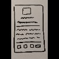
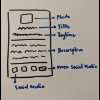
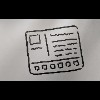
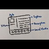

# mui-card

Learn [Material-UI](https://material-ui.com) with a business card

---

<!-- markdown-toc start - Don't edit this section. Run M-x markdown-toc-refresh-toc -->

**Table of Contents**

- [mui-card](#mui-card)
  - [Usage](#usage)
    - [Install](#install)
    - [Serve](#serve)
  - [Prototypes](#prototypes)
    - [lt_sm](#lt_sm)
    - [gte_sm](#gte_sm)
  - [Lessons](#lessons)
    - [1. Setup](#1-setup)
      - [1.1. Install](#11-install)
      - [1.2. Configure](#12-configure)
        - [1.2.1. CssBaseline](#121-cssbaseline)
        - [1.2.2. Roboto font](#122-roboto-font)
        - [1.2.3. Viewport](#123-viewport)
    - [2. Theming](#2-theming)
      - [2.1. makeStyles](#21-makestyles)
      - [2.2. useTheme](#22-usetheme)
      - [2.3. hue[shade]](#23-hueshade)
      - [2.4. Custom theme](#24-custom-theme)
      - [2.5. responsiveFontSizes](#25-responsivefontsizes)
    - [3. Layout](#3-layout)
      - [3.1. Box](#31-box)
      - [3.2. Container](#32-container)
      - [3.3. Grid](#33-grid)
      - [3.4. Hidden](#34-hidden)
    - [4. Inputs](#4-inputs)
      - [4.1. Button](#41-button)
    - [5. Navigation](#5-navigation)
      - [5.1. Links](#51-links)
  - [License](#license)

<!-- markdown-toc end -->

---

## Usage

### Install

```shell
$ npm [install|isntall|add|i]
```

### Serve

```shell
$ npm start
```

---

## Prototypes

[](./.prototypes/images/breadboard.jpg "Breadboard")

### lt_sm

[](./.prototypes/images/lt_sm/sketch.jpg "Sketch")
[](./.prototypes/images/lt_sm/elements.jpg "Elements")

### gte_sm

[](./.prototypes/images/gte_sm/sketch.jpg "Sketch")
[](./.prototypes/images/gte_sm/elements.jpg "Elements")

---

## Lessons

### 1. Setup

#### 1.1. Install

```shell
$ npm i @material-ui/{core,icons} \
        fontsource-roboto
```

> **Notes:**
>
> - [`icons`](https://material-ui.com/components/material-icons) package are converted [`SvgIcon`](https://material-ui.com/api/svg-icon) components
> - `SvgIcon`s use [PascalCase](https://wiki.c2.com/?PascalCase) as naming convention
> - [Roboto](https://fonts.google.com/specimen/Roboto) fonts must be specified manually

#### 1.2. Configure

##### 1.2.1. CssBaseline

```javascript
// file: src/App.js
// …

import { CssBaseline } from "@material-ui/core";

const App = () => {
  return (
    <div …>
      <CssBaseline />
    // …
```

> **Note:** <br />
> The [`<CssBaseline />`](https://material-ui.com/components/css-baseline) fix inconsistencies across browsers and devices with an opinionated resets.

##### 1.2.2. Roboto font

```javascript
// file: src/App.js
// …
import "fontsource-roboto/300.css";
import "fontsource-roboto/400.css";
import "fontsource-roboto/500.css";
import "fontsource-roboto/700.css";

import { …, Typography } from "@material-ui/core";

const App = () => {
  return (
    <div …>
      // …
      <Typography variant="h1">hello, world</Typography>
    // …
```

> **Note:** <br />
> Only `300`, `400`, `500` and `700` of typography font weights are being used by Material-UI.

##### 1.2.3. Viewport

```html
<!-- file: public/index.html -->
<!-- … -->
<html …>
  <head>
    <!-- … -->
    <meta
      name="viewport"
      content="minimum-scale=1, initial-scale=1, width=device-width"
    />
    <!-- … -->
  </head>
  <!-- … -->
</html>
```

> **Note:** <br />
> The [`<meta name="viewport" />`](https://developer.mozilla.org/en-US/docs/Mozilla/Mobile/Viewport_meta_tag#Enter_viewport_meta_tag) ensures proper rendering and touch zooming for all browsers and devices.

### 2. Theming

#### 2.1. makeStyles

```javascript
// file: src/App.js
// …
import { makeStyles } from "@material-ui/core/styles";

const useStyles = makeStyles(({ palette: { common: { black, white } } }) => ({
  root: {
    backgroundColor: black,
    "& h1": { color: white },
  },
}));

const App = () => {
  const { root } = useStyles();
  return (
    <div className={root}>
      // …
```

> **Notes:**
>
> - [`makeStyles`](https://material-ui.com/styles/api/#makestyles-styles-options-hook) links a style sheet with a function component (returns a hook)
> - `makeStyles(props)` can mix values of component `props` with `theme` object
> - `theme` property object contains the design properties of the application
> - `"&"` implies child elements under the element where `root` was assigned

#### 2.2. useTheme

```javascript
// file: src/App.js
// …
import { …, useTheme } from "@material-ui/core/styles";

// …
const App = () => {
  // …
  const {
    palette: { type },
  } = useTheme();

  return (
    <div …>
      // …
      <Typography …>hello, {type} world…
```

> **Note:** <br />
> The [`useTheme`](https://material-ui.com/styles/api/#usetheme-theme) hook returns the `theme` object that has access to theme's properties.

#### 2.3. hue[shade]

```javascript
// file: src/App.js
// …
import { grey } from "@material-ui/core/colors";

const useStyles = makeStyles(() => ({
  root: {
    backgroundColor: grey[900], // near-black: #212121
    "& h1": { color: grey[50] }, // near-white: #fafafa
  // …
```

> **Note:** <br />
> The `grey` object is one of MUI's [color palette](https://material-ui.com/customization/color/#color-palette)s (`grey[50…900]` means `hue[shade]`).

#### 2.4. Custom theme

```javascript
// file: src/App.js
// …
import { createMuiTheme, …, ThemeProvider, … } from "@material-ui/core/styles";
// …
const theme = createMuiTheme({ palette: { type: "dark" } });

const App = () => {
  // …
  return (
    <ThemeProvider theme={theme}>
      // …
    </ThemeProvider>
  // …
```

> **Notes:**
>
> - [`createMuiTheme`](https://material-ui.com/customization/theming/#createmuitheme-options-args-theme) returns the [default theme](https://material-ui.com/customization/default-theme) object that can be overridden
> - [`<ThemeProvider>`](https://material-ui.com/styles/api/#themeprovider) can pass `theme` as property to allow its children to access theme properties

#### 2.5. responsiveFontSizes

```javascript
// file: src/App.js
// …
import { …, responsiveFontSizes, … } from "@material-ui/core/styles";
// …
let theme = createMuiTheme( … )
theme = responsiveFontSizes(theme);
// …
```

> **Note:** <br />
> The [`responsiveFontSizes`](https://material-ui.com/customization/theming/#responsivefontsizes-theme-options-theme) generates responsive typography for the theme.

### 3. Layout

#### 3.1. Box

```javascript
// file: src/App.js
// …
import { Box, … } from "@material-ui/core";

const App …
  // …
  return (
    // …
    <ThemeProvider …>
      // …
        <Typography …>
          hello,
          <Box component="span" bgcolor="text.secondary" color="text.primary">
            {type}
          </Box>
          world
        …
```

> **Notes:**
>
> - [`<Box>`](https://material-ui.com/components/box) can access the full list of [style functions](https://material-ui.com/system/basics/#all-inclusive)
> - Use the `component` property to replace the element wrapper

#### 3.2. Container

```javascript
// file: src/App.js
// …
import { …, Container, … } from "@material-ui/core";
// …
const App = () => {
  // …
  return (
    <ThemeProvider …>
      <Container className={root} disableGutters={true}>
        // …
      </Container>
    // …
```

> **Notes:**
>
> - [`<Container>`](https://material-ui.com/components/container) centers its children horizontally
> - By default, `maxWidth` uses `lg` as grid breakpoint
> - `disableGutters` removes left and right `padding`

#### 3.3. Grid

```javascript
// file: src/App.js
// …
import { Box, …, Grid, Paper, Typography } from "@material-ui/core";
import { Mood } from "@material-ui/icons";
// …
const App = () => {
  // …
  return (
    // …
      <Container …>
        <Grid
          component={Paper}
          elevation={0}
          container
          direction="column"
          alignItems="center"
          spacing={4}
        >
          <Grid item>
            <Box mt={4}>
              
            </Box>
          </Grid>
          <Grid item>
            <Typography variant="h1">title</Typography>
          </Grid>
          <Grid item>
            <Typography variant="subtitle1">subtitle</Typography>
          </Grid>
          <Grid item>
            <Typography variant="body1">description</Typography>
          </Grid>
          <Grid item container justify="space-evenly">
            <Mood />
          </Grid>
        </Grid>
      </Container>
    // …
```

> **Notes:**
>
> - [`<Grid>`](https://material-ui.com/components/grid) is based on [Material Design](https://material.io/design/layout/responsive-layout-grid.html)'s 12-column [responsive layout grid](https://material.io/design/layout/responsive-layout-grid.html)
> - It implements the grid system using [CSS Flexible Box Layout Module](https://www.w3.org/TR/css-flexbox-1)
> - Types of grid layout includes: `container` or `item`
> - Supports nested grids by using both `container` and `item`
> - Supports five available grid [breakpoints](https://material-ui.com/customization/breakpoints/#default-breakpoints): `xs`, `sm`, `md`, `lg` and `xl`
> - Each grid uses percentage (fluid) and relative to parent element
> - Each grid has `padding` used to space content within the each grid item
> - Each grid are separated with [`spacing`](https://material-ui.com/customization/spacing) theme property
> - Each `spacing` is `8px` (minimum: `0`, maximum: `10`)
> - Each grid automatically resizes on available space (auto-layout)
> - [`<Paper>`](https://material-ui.com/components/paper) can be used as `<Grid>`'s `component` wrapper
> - `<Paper>`'s `props` becomes part of `<Grid>`'s `props`

#### 3.4. Hidden

```javascript
// file: src/App.js
// …
import { …, Hidden, … } from "@material-ui/core";
import { …, MoreHoriz } from "@material-ui/icons";
// …
const App = () => {
  // …
  return (
    // …
        <Grid …>
          // …
            <Mood />
            <Hidden smUp>
              <MoreHoriz />
            </Hidden>
          // …
```

> **Notes:**
>
> - [`<Hidden>`](https://material-ui.com/components/hidden) toggles component visibility with breakpoints
> - It is used in conjuction with `<Grid>`
> - By default, `js` is used to responsively hide components
> - `up` or `down` `props` hides _at_ or _above_ or _below_ breakpoint
> - `only` hides _at exact_ (`String` or `Array`) of breakpoint(s)

### 4. Inputs

#### 4.1. Button

```javascript
// file: src/App.js
// …
import { …, IconButton, … } from "@material-ui/core";
import { Facebook, … } from "@material-ui/icons";
// …
const App …
  // …
  return (
    // …
          <Grid item container justify="space-evenly">
            <IconButton href="https://facebook.com">
              <Facebook />
            </IconButton>
            // …
```

> **Notes:**
>
> - [`<Button>`](https://material-ui.com/components/buttons) communicates user actions
> - `<Button>`s typically is used in conjunction with `onClick` event
> - Use `contained` as `variant` `props` for primary and highly important actions
> - Use `outlined` as `variant` `props` for non-primary but important actions
> - Use a regular button (without `variant` `props`) for non-critical actions
> - Use `startIcon` `props` to prepend `<Button>` with an [icon](https://material-ui.com/ecomponents/icons) component
> - Use `<IconButton>` component to simply render a clickable icon
> - Use `<LoadingButton>` component to show pending state and disable interaction
> - For internal links, use `<Link>` from [`react-router-dom`](https://github.com/ReactTraining/react-router) with `component` and `to` `props`
> - `react-router-dom`'s `<Link>` must be within [`react-router`](https://reactrouter.com)'s '`<MemoryRouter>`
> - For external links, use `href` `props` (e.g. `<Button href={url}>…`); `url`'s [protocol](https://developer.mozilla.org/en-US/docs/Glossary/Protocol) is required

### 5. Navigation

#### 5.1. Links

```javascript
// file: src/App.js
// …
import { …, Link, … } from "@material-ui/core";
// …
const App …
  // …
  return (
    // …
          <Grid item>
            <Link variant="h1" color="inherit">
              title
            </Link>
          // …
```

> **Notes:**
>
> - [`<Link>`](https://material-ui.com/components/links) customize anchor elements with theme colors and typography styles
> - `<Link>` is built on top of `<Typography>` and shares all of its `props`
> - Use `rel="noopener"` to prevent external redirects
> - Use `rel="noreferrer"` to prevent sending _Referer_ header
> - Implementing internal links is similar to `<Button>`

---

## License

`mui-card` is licensed under [MIT](./LICENSE).
